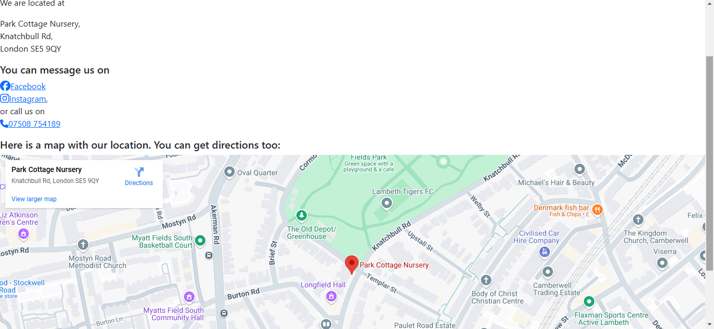

!

#README file for static website project Milestone 1.

For this project, I have decided to design a landing page for my friend's nursery/childcare business that has recently opened to the public. It will incorprate a home page, an about page, and a contact page.

It uses a mixture of original code, bootstrap css, and fonts and logos taken primarily from google. A couple are from Fontawesome.

The images used are all original work provided by the business owner

There is extraneous data in the branch at present due to me originally wanting to have a local incident of bootstrap in order to play with and adjust sass files for the site, but after looking at the design brief I decided it would be more in keeping with the project to make adjustments through a stylesheet.

In terms of interactivity, currently limited to a dropdown menu for page navigation, and an embedded google map for ease of directions. Outside links to Facebook and Instagram have been added.

The blurb on the About page is all taken with permission from the business' Facebook page.

HTML has been validated with https://validator.w3.org/ with no errors, 2 warnings related to null space in image links that dont affect desired output.
CSS has been validated with https://jigsaw.w3.org/ with no errors.

Commented out text has been removed from all pages to ease readability.

###User Stories

I'm a local resident who wants to look at available childcare locations near me

